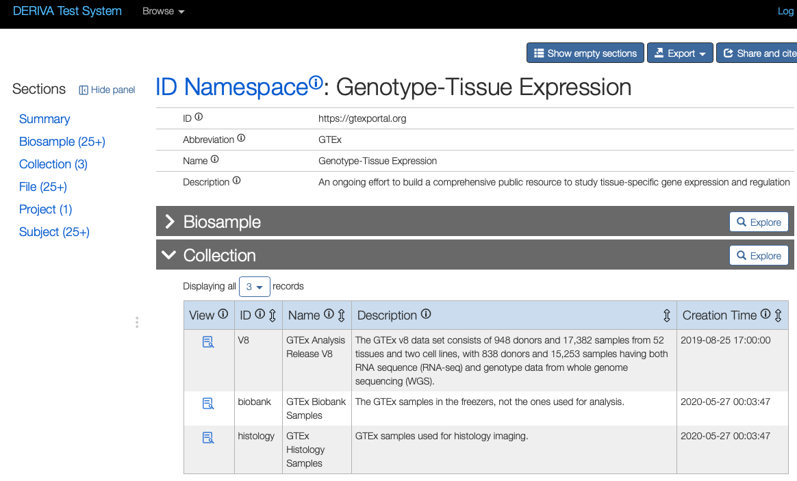

---
pdf_options:
  format: Letter
---

# GTEx V8 C2M2 Level 1 ETL Process

Some notes on getting the GTEx V8 data release into the Level 1
C2M2. Since this was a first run, so we focused on the just the V8 release.

Here is a short-lived site where the data can be viewed
  `https://demo.derivacloud.org/chaise/record/#333/CFDE:id_namespace/RID=3-07X2`

This is definitely a first draft that accurately describes a concept,
but needs to refined and expanded. Some immediate things that could be added:

 * More details for the sequence files (names, hashes)
 * The histology files should be added
 * Data from other releases
 * Representing the other releases
 * Creation dates for all entities

## Things (Proper Nouns)

The Level 1 C2M2 includes tables to describe the following things (entities), and the relationships between them.

 * Project
 * Collection
 * Subject
 * Biosample
 * File

## Data Sources

Here are the pages and files we pulled information from:

 * [GTEx Release Information](https://gtexportal.org/home/releaseInfoPage)
 * [Table of SRA Runs](https://trace.ncbi.nlm.nih.gov/Traces/study/?acc=phs000424&o=biospecimen_repository_sample_id_sam_s%3Aa%3Bacc_s%3Aa)
 * [Anatomy UBERON Terms](https://gtexportal.org/home/samplingSitePage)
 * [Histology](https://gtexportal.org/home/histologyPage)
 * [Biobank](https://gtexportal.org/home/datasets#datasetDiv4), `biobank_collection_20200528_070345.txt`

The input data is in [a GitHub repository](https://github.com/rpwagner/gtexdata/tree/master/inputdata).

## Namespace and Project

We defined a single namespace for all of the GTEx things. For this
first draft, we also defined a single project. For the persistent
identifier of the project, we used the dbGaP accession number linked
from the GTEx Portal, since it it resolves using `identifiers.org`:
`https://identifiers.org/dbgap:phs000424.v2.p1`.

## Collections

We also defined three collections, all associated with the GTEx
project and namespace.

 * A single collection for the V8 data release, using its specific accession
number as the persistent ID [dbgap:phs000424.v8.p2](https://identifiers.org/dbgap:phs000424.v8.p2).
 * A collection for the Biobank samples.
 * A collection for the histology samples.

## Subject

For the subject table, our primary goal was to find the unique name
GTEx uses for each. We pulled the subject IDs from three places:

 * `submitted_subject_id` column of the SRA run table, e.g.;
 * `Subject ID` in the histology table;
 * `subjectId` in the Biobank table.

## Biosample

The list of biosamples comes from the histology table, Biobank, and
the SRA run table. For each, we used the list of
[Uberon terms](https://gtexportal.org/home/samplingSitePage) on the
sampling page to determine the anatomy. For the Biobank samples, we did not provide an assay
type. For samples in the histology table, we used `OBI:0600020`,
`histology assay`. We used the following mapping of the `Assay Type`
column in the SRA run table:

 * `WGS`: `OBI:0002117`, whole genome sequencing assay
 * `RNA-Seq`: `OBI:0001271`, RNA-seq assay
 * `WXS`: `OBI:0002118`, exome sequencing assay

Currently, the C2M2 model does not include ontlogies like EFO for cell lines,
which is a need for some of the samples.

## File

The only files we could build a manifest of were from the SRA run
table. Unfortunately, the data from the DCPPC work wasn't
reusable. The DOIs no longer resolve and it wasn't clear enough if the
runs from SRA mapped to the manifest from the
[DCPPC Data Stewards repo](https://github.com/dcppc/data-stewards/tree/master/gtex/v7).

The end result is that we have a reasonable manifest of the number of
files, file sizes, and their types for the V8 release. What we lack is
the file names and hashes, without with we can't create Minids or
other identifiers.

To describe the files, we mapped `DATASTORE filetype` to the file
format, and `Assay Type` to data type, as so:

 * File formats
  - `crai,cram`: EDAM `format:3462`, CRAM
  - `cram,crai`: EDAM `format:3462`, CRAM
  - `bam,sra`: EDAM `format:2572`, BAM
  - `sra,bam`: EDAM `format:2572`, BAM
  - `bam,contigs,sra`: EDAM `format:2572`, BAM
  - `sra`: EDAM `format:3698`, SRA format
 * Data types
  - `RNA-Seq`: EDAM `data:3495`, RNA sequence
  - `WGS`: EDAM `data:3494`, DNA sequence
  - `WXS`: EDAM, `data:3494`, DNA sequence

## Relationships

Everything above laid out the things (subjects, files, etc.) that we
needed to describe. The remainder was showing the relationships, like
which file described which subject or sample. Most of those were
straightforward, like linking the samples and files from the SRA run
table. For the subject's role and taxonomy, we used the same terms for all
subjects, namely a single human, `NCBI:txid9606`.
